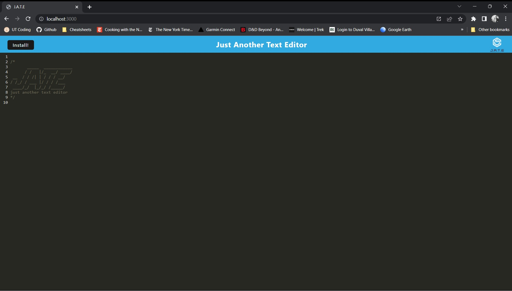

# JATE PWA

## Description
PWA for a simple text editor

## Table of Contents
1. [Installation](#installation)
2. [Usage](#usage)
3. [Licence](#licence)
4. [Contributors](#contributors)
5. [Test](#test)
6. [Questions](#questions)

## Installation 

To install, click the intall button

## Usage 

n/a

## License 

This project is run under the None licensure

## Contributors 

The contributors are: n/a

## Screenshot and walkthrough of applicaiton

## Test 

For tests, run this command:
>n/a

## Questions 

For quetions, please email at carterjamesmike@gmail.com or visit my github profile at [carterjamesmike](https://github.com/carterjamesmike)